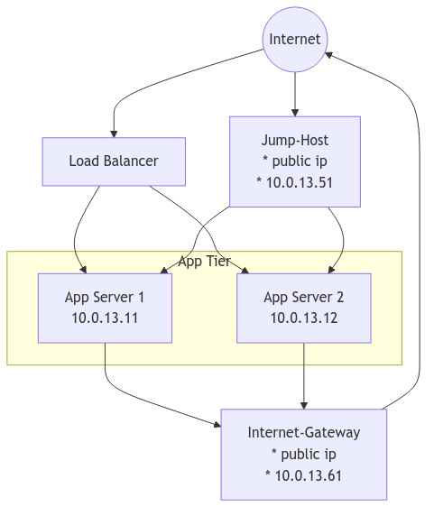

## Aufgabe 2



### SSH

SSH auf den Jump-Host:

    ssh root@<public-ip>

SSH Tunnel auf die Server im privaten Netzwerk

    ssh -A -J root@<public-ip> root@<private-ip>

Für die Mac-User (bitte die Platzhalter privatekey.pem, jumpserverhost, targetserver sinngemäß ersetzen)

    ssh -i privatekey.pem -o "ProxyCommand ssh -W %h:%p -i privatekey.pem user@jumpserverhost" user@targetserver

### Http Proxy installieren (Auf der Machine mit public IP)

Http Proxy `squid` installieren:

    apt-get update
    apt-get install squid
    nano /etc/squid/squid.conf

Zeile hinzufügen / einkommentieren und die derzeitige Liste für `localnet`
überprüfen, `10...` Netz sollte dabei sein:

    http_access allow localnet

Den Proxy-Server neu starten

    systemctl restart squid

### Http Proxy nutzen (auf den Servern im privaten Netz)

```
# Stand vorher checken
apt-get update # funktioniert nicht, weil keine Verbindung zum Internet

export http_proxy="http://10.0.12.51:3128"
export https_proxy="http://10.0.12.51:3128"

apt-get update # funktioniert jetzt!
```

Man kann während des Updates auf dem proxy Server die Aufrufe verfolgen

    tail -f /var/log/squid/access.log

### Aufgabe

Aufgabe: auf beiden Web/App-Servern nginx installieren und eine Homepage mit verschiedenen Inhalten vorbereiten:

```
apt-get update
apt-get install nginx
nano /var/www/html/...
```

Beide Web/App-Server in das Load-Balancing einbinden.
Die IP von dem Load-Balancer aufrufen und die Seite im Browser auffrischen. Kommen da mal die, mal die anderen Inhalte?

<!--
---

## Infrastruktur per Terraform erstellen

Terraform Datei herunterladen

https://raw.githubusercontent.com/geekq/kurs-infra-rechenzentren/refs/heads/main/tf-example-web-app-hetzner-vms/main.tf

Und Projektnamen anpassen von schulung1 auf schulung-teamN

```
terraform plan
terraform apply
```

-->

